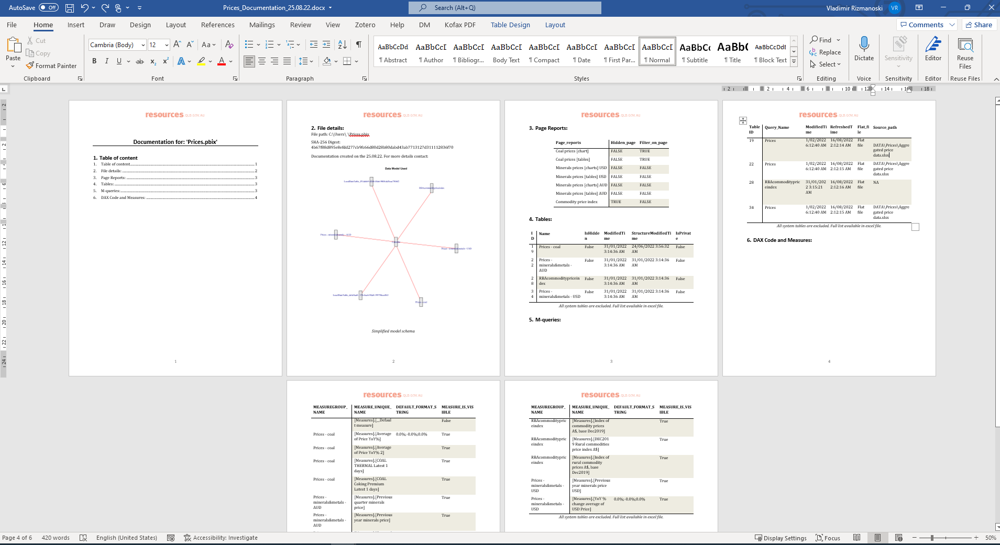
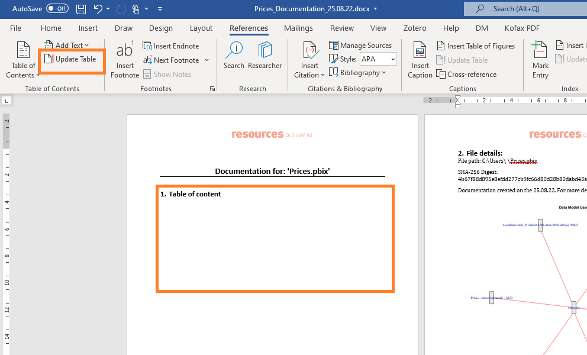
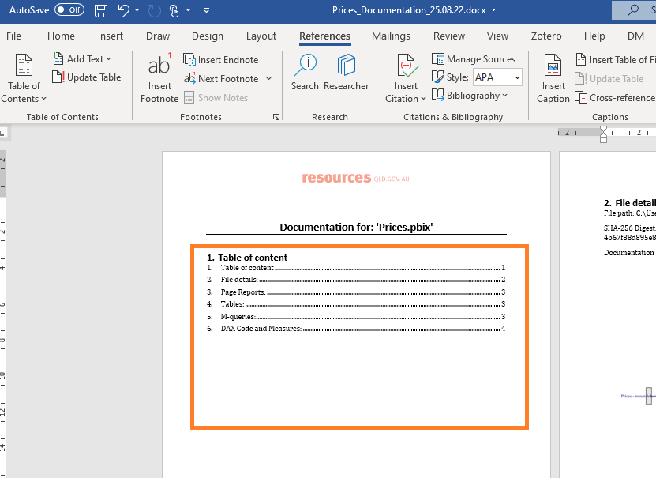
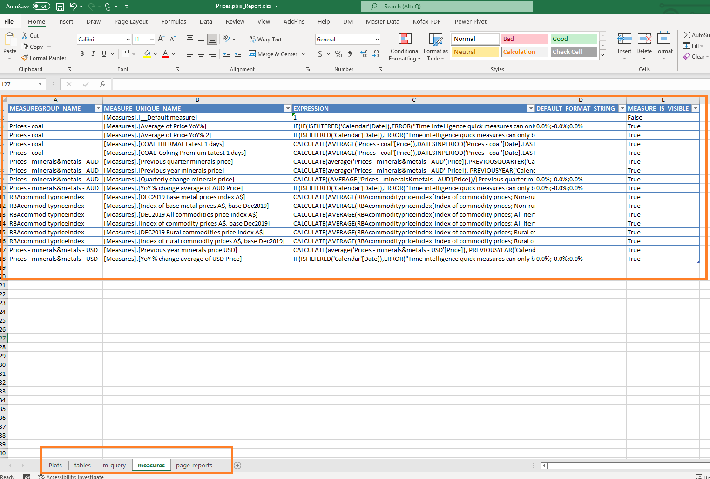
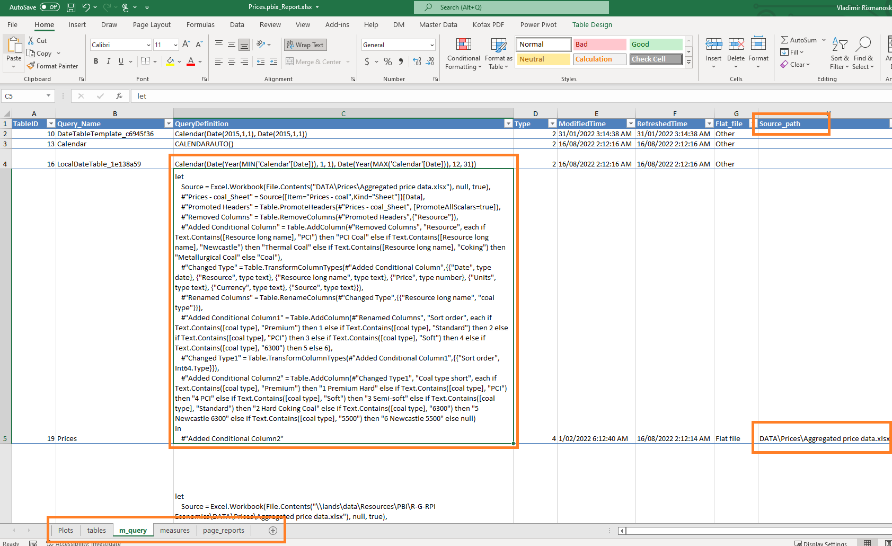

# build_pbix_documentation

Create very quickly word and excel documentation which includes:

-   SHA-256 of the pbix file

-   File path

-   Very basic database schema

-   All tables names

-   All M-queries

-   All measures

-   All page reports names

# Examples of the documents:

## Word Documentation:

Before you run the code, update word template with your logo and branding.

## Excel Documentation:

